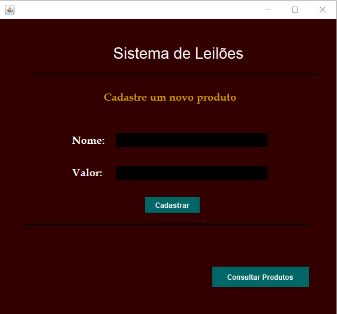
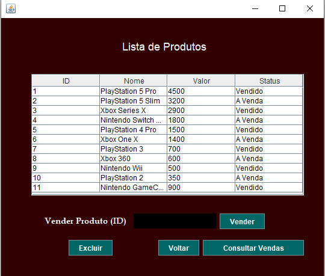
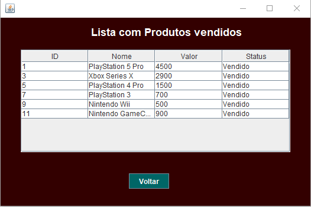
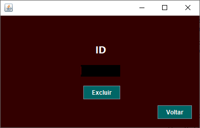

# Sistema de Leilões

## Sobre o Projeto

Este projeto foi desenvolvido durante o curso Técnico em Desenvolvimento de Software do Senac com o objetivo de praticar conceitos de programação Java, integração com banco de dados MySQL e operações CRUD.

O sistema simula um ambiente simples de gerenciamento de produtos para leilão, permitindo cadastrar, consultar e excluir produtos, além de visualizar itens vendidos.

Trata-se de um projeto acadêmico desenvolvido para aplicar na prática os conhecimentos adquiridos durante o curso.

## Tecnologias Utilizadas

* Java
* Java Swing
* MySQL
* JDBC
* NetBeans IDE
* Git
* GitHub

## Funcionalidades Implementadas

* Cadastro de produtos
* Consulta de produtos cadastrados
* Consulta de produtos vendidos
* Exclusão de produtos
* Integração com banco de dados MySQL
* Persistência de dados utilizando JDBC
* Interface gráfica desenvolvida com Swing

## Telas do Sistema

### Cadastro de Produtos

<p align="center">
  
</p>

### Lista de Produtos

<p align="center">
  
</p>

### Lista de Produtos Vendidos

<p align="center">
  
</p>

### Exclusão de Produtos

<p align="center">
  
</p>

## Banco de Dados

Para executar o projeto é necessário criar previamente o banco de dados:

```sql
CREATE DATABASE bancoleiloes;
```

Após criar o banco de dados, execute o script SQL disponível na pasta:

```text
banco/bancoleiloes_produtos.sql
```

O script realizará automaticamente:

* Criação da tabela de produtos
* Inserção de registros para testes
* Configuração inicial do sistema

## Estrutura do Projeto

```text
SistemaLeiloes/
├── src/
│   ├── conexao
│   ├── DAO
│   ├── objetos
│   ├── Principal
│   └── VIEW
│
├── banco/
│   └── bancoleiloes_produtos.sql
│
├── screenshots/
│   ├── cadastro.png
│   ├── lista-produtos.png
│   ├── lista-produtos-vendidos.png
│   └── excluir-produtos.png
│
└── README.md
```

## Aprendizados

Durante o desenvolvimento deste projeto foram praticados conceitos de:

* Programação Orientada a Objetos (POO)
* Desenvolvimento de aplicações desktop
* Integração Java com MySQL
* JDBC
* Operações CRUD
* Estruturação de projetos Java
* Versionamento com Git e GitHub

## Autor

Matheus Silva Melo

Projeto desenvolvido durante o curso Técnico em Desenvolvimento de Software do Senac.
